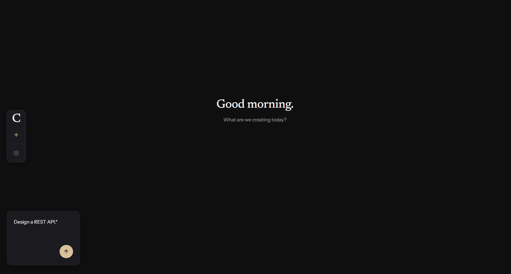
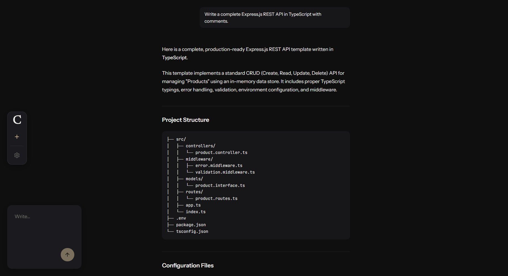
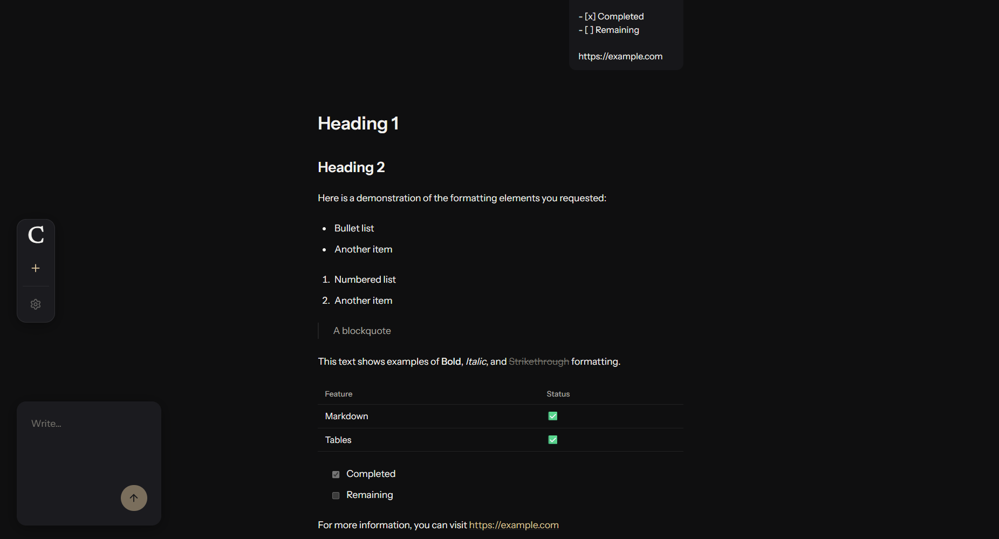
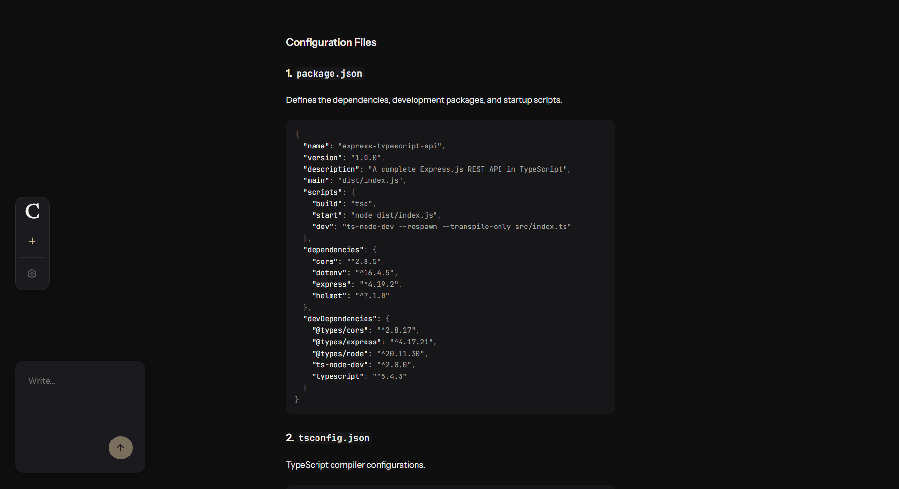

# Clem

> An editorial AI workspace designed for calm reading and thoughtful writing.

Clem is a modern AI client that treats conversations like documents instead of chat logs.

Rather than surrounding every response with visual chrome, Clem focuses on typography, whitespace, and structure, making long technical explanations, code, and documentation comfortable to read.

---

## Why Clem?

Most AI interfaces optimize for speed.

Clem optimizes for comprehension.

Instead of chat bubbles, saturated colors, and constant visual noise, Clem presents AI responses as editorial content—calm, readable, and designed for extended thinking.

Every design decision follows one principle:

> **Reduce interface. Increase understanding.**

---

## Features

### Editorial Interface

- Bubble-less assistant responses
- Typography-first reading experience
- Carefully controlled whitespace
- Calm motion system
- Floating workspace layout

### Markdown Rendering

- Headings
- Lists
- Tables
- Blockquotes
- Task lists
- Syntax-highlighted code blocks
- Horizontal scrolling for long code lines
- GitHub Flavored Markdown support

### Multi-Provider Architecture

- Google Gemini
- Anthropic Claude
- Provider-agnostic backend
- Unified API contract
- Consistent error normalization

### Design System

- Token-driven UI
- Semantic color system
- Editorial typography
- Motion hierarchy
- Accessibility-first

---

# Architecture

```
                    React + TypeScript
                           │
                           ▼
                    Express API
                           │
                           ▼
                     ChatService
                           │
                           ▼
                     AIProvider
                  ┌────────┴────────┐
                  ▼                 ▼
             Gemini          Anthropic
```

The frontend never communicates directly with an AI provider.

Every provider implements the same interface, allowing new models to be added without changing the frontend or application logic.

---

# Tech Stack

### Frontend

- React 19
- TypeScript
- Tailwind CSS v4
- Framer Motion
- React Markdown
- Remark GFM
- Prism Syntax Highlighting

### Backend

- Express 5
- TypeScript
- Zod
- Google Gen AI SDK
- Anthropic SDK

---

# Project Philosophy

Clem is built around a few core ideas.

### Typography before chrome

The interface should disappear while reading.

### Motion communicates

Animation exists only to explain state, never to decorate.

### Tokens over hardcoded values

Every visual decision belongs to the design system.

### Provider independence

Changing AI providers should never require frontend changes.

### Calm by default

Whitespace is a feature.

Color is earned.

Motion is purposeful.

---

# Screenshots

- Landing page


- Conversation view


- Markdown rendering


- Code blocks


---

# Getting Started

## Clone

```bash
git clone <repository-url>
cd Clem
```

## Install

```bash
npm install
```

## Configure

Create:

```
backend/.env
```

Example:

```env
AI_PROVIDER=gemini
AI_MODEL=gemini-3.5-flash
GEMINI_API_KEY=your_api_key_here
```

or

```env
AI_PROVIDER=anthropic
AI_MODEL=<claude-model>
ANTHROPIC_API_KEY=your_api_key_here
```

## Run

Backend

```bash
npm run dev:backend
```

Frontend

```bash
npm run dev:frontend
```

Open:

```
http://localhost:5173
```

---

# Current Status

Current release:

**v0.1**

Completed

- Editorial interface
- Markdown rendering
- Gemini integration
- Anthropic integration
- Provider abstraction
- Design token system
- Responsive layout
- Accessibility foundation

---

# Roadmap

Future work includes:

- Conversation history
- Search
- Export
- Themes
- Attachments
- Model selection
- Streaming responses

---

# Contributing

Contributions, ideas, and discussions are welcome.

Before opening a pull request, please ensure new changes respect the project's design philosophy and architectural boundaries.

---

# License

MIT License